<div class="cover" style="page-break-after:always;font-family:方正公文仿宋;width:100%;height:100%;border:none;margin: 0 auto;text-align:center;">
    <div style="width:50%;margin: 0 auto;height:0;padding-bottom:10%;">
        </br>
        
    </div>
    </br></br>
    <div style="width:40%;margin: 0 auto;height:0;padding-bottom:40%;">
        
    </div>
		</br></br></br>
    <span style="font-family:华文黑体Bold;text-align:center;font-size:20pt;margin: 10pt auto;line-height:30pt;">本科生实验报告</span>
    </br>
    </br>
    <table style="border:none;text-align:center;width:72%;font-family:仿宋;font-size:14px; margin: 0 auto;">
    <tbody style="font-family:方正公文仿宋;font-size:12pt;">
        <tr style="font-weight:normal;"> 
            <td style="width:20%;text-align:center;">课程名称</td>
            <td style="width:40%;font-weight:normal;border-bottom: 1px solid;text-align:center;font-family:华文仿宋">模式识别</td>
      </tr>
        <tr style="font-weight:normal;"> 
            <td style="width:20%;text-align:center;">实验名称</td>
            <td style="width:40%;font-weight:normal;border-bottom: 1px solid;text-align:center;font-family:华文仿宋">半监督图像分类</td>
      </tr>
        <tr style="font-weight:normal;"> 
            <td style="width:20%;text-align:center;">专业名称</td>
            <td style="width:40%;font-weight:normal;border-bottom: 1px solid;text-align:center;font-family:华文仿宋">计算机科学与技术</td>
      </tr>
        <tr style="font-weight:normal;"> 
            <td style="width:20%;text-align:center;">学生姓名</td>
            <td style="width:40%;font-weight:normal;border-bottom: 1px solid;text-align:center;font-family:华文仿宋">李世源</td>
      </tr>
        <tr style="font-weight:normal;"> 
            <td style="width:20%;text-align:center;">学生学号</td>
            <td style="width:40%;font-weight:normal;border-bottom: 1px solid;text-align:center;font-family:华文仿宋">22342043</td>
      </tr>
        <tr style="font-weight:normal;"> 
            <td style="width:20%;text-align:center;">实验成绩</td>
            <td style="width:40%;font-weight:normal;border-bottom: 1px solid;text-align:center;font-family:华文仿宋"></td>
      </tr>
      <tr style="font-weight:normal;"> 
            <td style="width:20%;text-align:center;">报告时间</td>
            <td style="width:40%;font-weight:normal;border-bottom: 1px solid;text-align:center;font-family:华文仿宋">2025年06月07日</td>
      </tr>
    </tbody>              
    </table>
</div>

<!-- 注释语句：导出PDF时会在这里分页，使用 Typora Newsprint 主题放大 125% -->

## 代码使用说明

1. 安装依赖：`pip install torch torchvision numpy matplotlib`

2. 运行MixMatch：`python main.py -t mixmatch -nl [40|250|4000]`

3. 运行FixMatch：`python main.py -t fixmatch -nl [40|250|4000]`

4. 参数说明：

|  参数缩写  |   完整参数名    | 类型  | 默认值  | 可选值/说明                     |
|----------|----------------|-------|---------|--------------------------------|
| `-nl`    | `--num_labels` | `int`   | `40`      | 实验要求为 `40`, `250`, `4000` |
| `-ni`    | `--num_iters`  | `int`   | `20000`   | 实验要求为 `20000` |
| `-ei`    | `--eval_iter`  | `int`   | `50`      | 评估间隔迭代次数 |
| `-t`     | `--type`       | `str`   | `mixmatch` | 指定 mixmatch 还是 fixmatch |
| `-d`     | `--draw`       | `bool`  | `True`    | 是否绘制图表 |

## 数据集处理

使用 CIFAR-10 数据集，包含 50000 张训练图像和 10000 张测试图像，分为 10 个类别。为了方便起见，同时也参考了 TorchSSL 的实现，我将 MixMatch 和 FixMatch 的 dataloader 实现统一在一起，都由 `get_cifar10_dataloaders.py` 完成。

在这里先定义三种数据增强：

```python
# 标准增强（用于测试）
test_transform = transforms.Compose([
    transforms.ToTensor(),
    transforms.Normalize((0.4914, 0.4822, 0.4465), (0.2023, 0.1994, 0.2010))
])


# 弱增强
weak_transform = transforms.Compose([
    transforms.RandomHorizontalFlip(),
    transforms.RandomCrop(32, padding=4),
    transforms.ToTensor(),
    transforms.Normalize((0.4914, 0.4822, 0.4465), (0.2023, 0.1994, 0.2010))
])

# 强增强
strong_transform = transforms.Compose([
    transforms.RandomHorizontalFlip(),
    transforms.RandomCrop(32, padding=4),
    RandAugment(n=2, m=10),
    transforms.ToTensor(),
    transforms.Normalize((0.4914, 0.4822, 0.4465), (0.2023, 0.1994, 0.2010)),
])
```

MixMatch 对无标签数据的 K 次不同增强我在 `MixMatch/mixmatch.py` 中对输入的无标签数据的弱增强版本实现处理。

首先加载数据，这里先全部加载，稍后分割。其中有标签数据进行 FixMatch 中的 “弱增强”，也作为 MixMatch 中的训练集增强。而无标签数据先不指定 `transform`，因为在 FixMatch 中需要同时对其若增强和强增强，所以稍后用自定义 Dataset 实现。

```python
labeled_base_dataset = torchvision.datasets.CIFAR10(
    root='./data', train=True, download=True, transform=weak_transform
)

unlabeled_base_dataset = torchvision.datasets.CIFAR10(
    root='./data', train=True, download=True, transform=None
)

labeled_test_dataset = torchvision.datasets.CIFAR10(
    root='./data', train=False, download=True, transform=test_transform
)
```

创建平衡的有标签子集，通过 `create_balanced_labeled_subset` 完成，根据指定每一个类的标注样本数量（40/250/4000）收集被选为有标签数据的下标：

```python
def create_balanced_labeled_subset(dataset, num_labeled_per_class):
    targets = np.array([dataset[i][1] for i in range(len(dataset))])
    labeled_indices = []
    
    for class_idx in range(10):  # CIFAR-10有10个类别
        class_indices = np.where(targets == class_idx)[0]
        selected_indices = np.random.choice(
            class_indices, num_labeled_per_class, replace=False
        )
        labeled_indices.extend(selected_indices)
    
    return labeled_indices

labeled_indices = create_balanced_labeled_subset(unlabeled_base_dataset, num_labeled_per_class=num_labels)
```

然后依据下标分割数据集：

```python
all_indices = set(range(len(labeled_base_dataset)))
unlabeled_indices = list(all_indices - set(labeled_indices))

labeled_dataset = Subset(labeled_base_dataset, labeled_indices)
unlabeled_dataset = Subset(unlabeled_base_dataset, unlabeled_indices)
```

然后对分割好的无标签数据集，创建如下自定义数据集，它每次同时返回弱增强和强增强版本的数据：

```python
class UnlabeledDataset(Dataset):
    def __init__(self, dataset):
        self.dataset = dataset
    
    def __len__(self):
        return len(self.dataset)
    
    def __getitem__(self, idx):
        img, label = self.dataset[idx]
        img1 = weak_transform(img)
        img2 = strong_transform(img)
        return (img1, img2), label

unlabeled_dataset = UnlabeledDataset(unlabeled_dataset)
```

最后创建 Dataloader，我参考了 TorchSSL 的实现，半监督学习习惯基于 iteration 进行训练，所以这里对有标签数据和无标签数据需要随机选取完成指定 iteration 数量的样本，因此实现如下：

```python
 # 计算数据的批次大小
labeled_batch_size = batch_size
unlabeled_batch_size = batch_size * mu

# 创建数据加载器
labeled_loader = DataLoader(
    labeled_dataset,
    batch_sampler=BatchSampler(
        RandomSampler(labeled_dataset, replacement=True, num_samples=labeled_batch_size*num_iters),
        labeled_batch_size,
        drop_last=True
    ),
    num_workers=num_workers,
    pin_memory=False
)

unlabeled_loader = DataLoader(
    unlabeled_dataset,
    batch_sampler=BatchSampler(
        RandomSampler(unlabeled_dataset, replacement=True, num_samples=unlabeled_batch_size*num_iters),
        unlabeled_batch_size,
        drop_last=True
    ),
    num_workers=num_workers,
    pin_memory=False
)

test_loader = DataLoader(
    labeled_test_dataset,
    batch_sampler=BatchSampler(
        RandomSampler(labeled_test_dataset, replacement=True, num_samples=len(labeled_test_dataset)),
        test_batch_size,
        drop_last=True
    ),
    num_workers=num_workers,
    pin_memory=False
)
```

## 训练框架

MixMatch 和 FixMatch 训练框架大体相似，代码框架如下：

```python
optimizer = optim.Adam(model.parameters(), lr=lr)
scheduler = optim.lr_scheduler.CosineAnnealingLR(optimizer, T_max=num_iters)

# 损失函数
labeled_criterion = nn.CrossEntropyLoss()
unlabeled_criterion = nn.MSELoss()

labeled_iter = iter(labeled_loader)
unlabeled_iter = iter(unlabeled_loader)

model.train()

for iteration in range(num_iters):
    # 获取有标签数据
    labeled_batch = next(labeled_iter)
    labeled_data, labeled_targets = labeled_batch
    labeled_data, labeled_targets = labeled_data.to(device), labeled_targets.to(device)
    
    # 获取无标签数据
    unlabeled_batch = next(unlabeled_iter)
    (unlabeled_data_weak, unlabeled_data_strong), _ = unlabeled_batch
    weak_unlabeled, strong_unlabeled = weak_unlabeled.to(device), strong_unlabeled.to(device)
    
    # 前向传播......
    
    # 计算有标签损失......
    
    # 计算无标签损失......
    
    # 总损失
    loss = labeled_loss + lambda_u * unlabeled_loss
    
    # 反向传播
    optimizer.zero_grad()
    loss.backward()
    optimizer.step()
    scheduler.step()
```

## MixMatch 实现

### 算法原理

MixMatch 结合了熵最小化和一致性正则化：
1. 对无标签数据进行 K 次增强，计算模型平均预测分布
2. 使用 sharpen 函数锐化预测分布作为伪标签
3. 将有标签和无标签数据通过 Mixup 方式构建新数据集
4. 使用新数据集训练模型

### MixUp

代码位于 `MixMatch/mixup.py`，实现对无标签数据和有标签数据 mixup 得到混合数据。

```python
def mixmup(X, Y, U, model, T=0.5, K=2, alpha=0.75):
    model.eval()
    
    # 为无标签数据生成伪标签
    with torch.no_grad():
        U_predictions = []
        for k in range(K):
            pred = F.softmax(model(U), dim=1)
            U_predictions.append(pred)
        
        # 平均预测结果并锐化
        avg_pred = torch.stack(U_predictions).mean(dim=0)
        q_b = sharpen(avg_pred, T)
    
    model.train()
    
    # 合并所有数据并进行MixUp
    W = torch.cat([X, U], dim=0)
    labels = torch.cat([Y, q_b], dim=0)
    idx = torch.randperm(W.size(0))
    
    # 分别对有标签和无标签数据进行MixUp
    X_mixed, labels_a_X, labels_b_X, lam_X = mixup_data(W[:X.size(0)], labels[:X.size(0)], alpha)
    U_mixed, labels_a_U, labels_b_U, lam_U = mixup_data(W[X.size(0):], labels[X.size(0):], alpha)
    
    return X_mixed, (labels_a_X, labels_b_X, lam_X), U_mixed, (labels_a_U, labels_b_U, lam_U)
```

其中温度缩放锐化预测函数 `sharpen` 实现如下：

```python
def sharpen(p, T=0.5):
    return (p ** (1/T)) / (p ** (1/T)).sum(dim=1, keepdim=True)
```

最后执行 MixUp 数据增强的 `mixup_data` 函数实现如下：

```python
def mixup_data(x, y, alpha=1.0):
    """执行Mixup数据增强"""
    if alpha > 0:
        lam = np.random.beta(alpha, alpha)
    else:
        lam = 1

    batch_size = x.size(0)
    index = torch.randperm(batch_size).to(x.device)

    mixed_x = lam * x + (1 - lam) * x[index, :]
    y_a, y_b = y, y[index]
    return mixed_x, y_a, y_b, lam
```

### 训练过程

填充在训练框架中的代码如下：

```python
# 转换标签为one-hot编码
labeled_targets_oh = F.one_hot(labeled_targets, num_classes=10).float()

# 执行MixMatch
X_mixed, (labels_a_X, labels_b_X, lam_X), U_mixed, (labels_a_U, labels_b_U, lam_U) = \
    mixup(labeled_data, labeled_targets_oh, unlabeled_data, model)

# 前向传播
logits_X = model(X_mixed)
logits_U = model(U_mixed)

# 计算有标签损失
labeled_loss = mixup_criterion(labeled_criterion, logits_X, 
                                labels_a_X.argmax(dim=1), labels_b_X.argmax(dim=1), lam_X)

# 计算无标签损失
probs_U = F.softmax(logits_U, dim=1)
unlabeled_loss = lam_U * unlabeled_criterion(probs_U, labels_a_U) + \
                (1 - lam_U) * unlabeled_criterion(probs_U, labels_b_U)     
```

这里对有标签数据使用 `mixup_criterion` 计算损失，其具体实现如下：

```python
def mixup_criterion(criterion, pred, y_a, y_b, lam):
    return lam * criterion(pred, y_a) + (1 - lam) * criterion(pred, y_b)
```

## FixMatch 实现

### 算法原理

FixMatch 结合了伪标签和一致性正则化：

1. 有标签数据：标准监督学习
2. 无标签数据：
   - 弱增强后生成伪标签（仅保留高置信度预测）
   - 强增强后使用伪标签进行监督

相比 MixMatch，FixMatch 的实现要更加简单一些。

### 训练过程

填充在训练框架中的代码如下：

```python
batch_size = labeled_data.shape[0]

# 合并所有数据进行前向传播
all_inputs = torch.cat([labeled_data, weak_unlabeled, strong_unlabeled], dim=0)
all_logits = model(all_inputs)

# 分离输出
labeled_logits = all_logits[:batch_size]
weak_unlabeled_logits = all_logits[batch_size:batch_size + weak_unlabeled.shape[0]]
strong_unlabeled_logits = all_logits[batch_size + weak_unlabeled.shape[0]:]

# 计算有标签损失
labeled_loss = labeled_criterion(labeled_logits, labeled_targets)

# 生成伪标签（使用弱增强的预测）
with torch.no_grad():
    weak_probs = F.softmax(weak_unlabeled_logits, dim=1)
    max_probs, pseudo_labels = torch.max(weak_probs, dim=1)
    mask = max_probs >= threshold

# 计算无标签损失（只对高置信度样本）
if mask.sum() > 0:
    unlabeled_loss = (unlabeled_criterion(strong_unlabeled_logits, pseudo_labels) * mask).mean()
else:
    unlabeled_loss = torch.tensor(0.0).to(device)
```

## 实验结果与分析

### 我自己的实现

以下是我的 MixMatch(左列) 和 FixMatch(右列) 用每类 40(第一行)、250(第二行)、4000(第三行) 训练过程的损失和测试准确率变化情况图：

<div style="text-align: center;">
  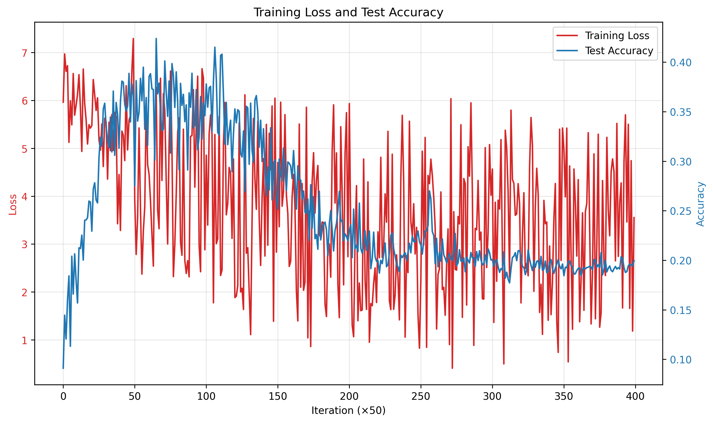
  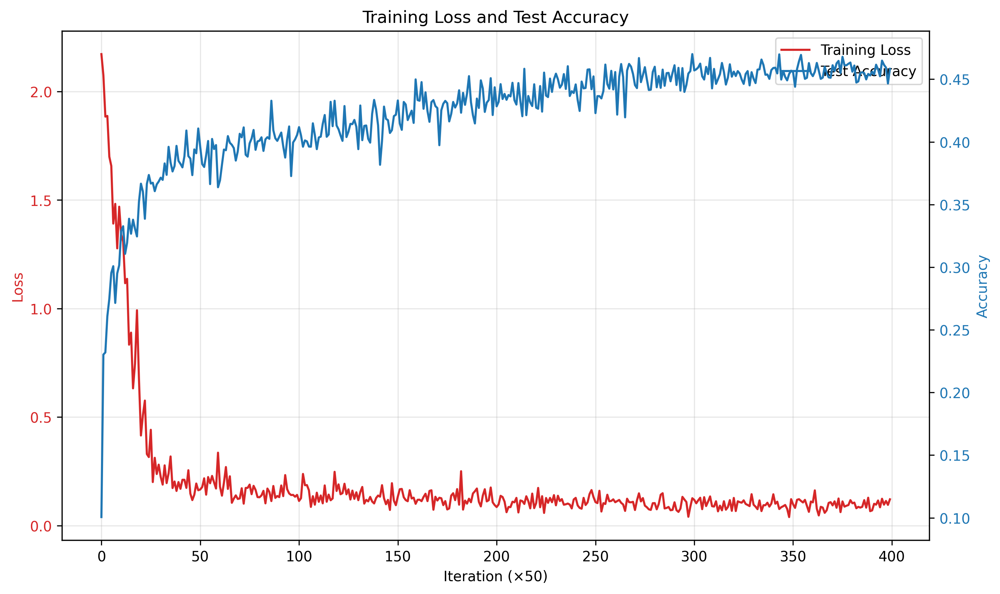
</div>
<div style="text-align: center;">
  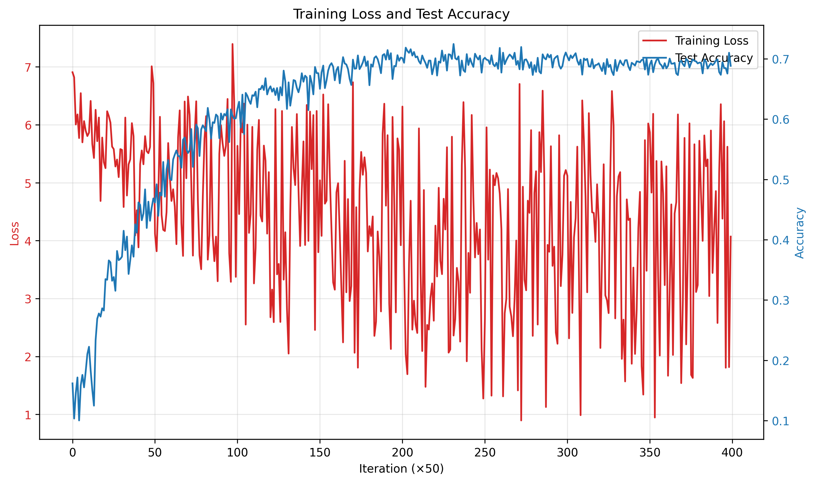
  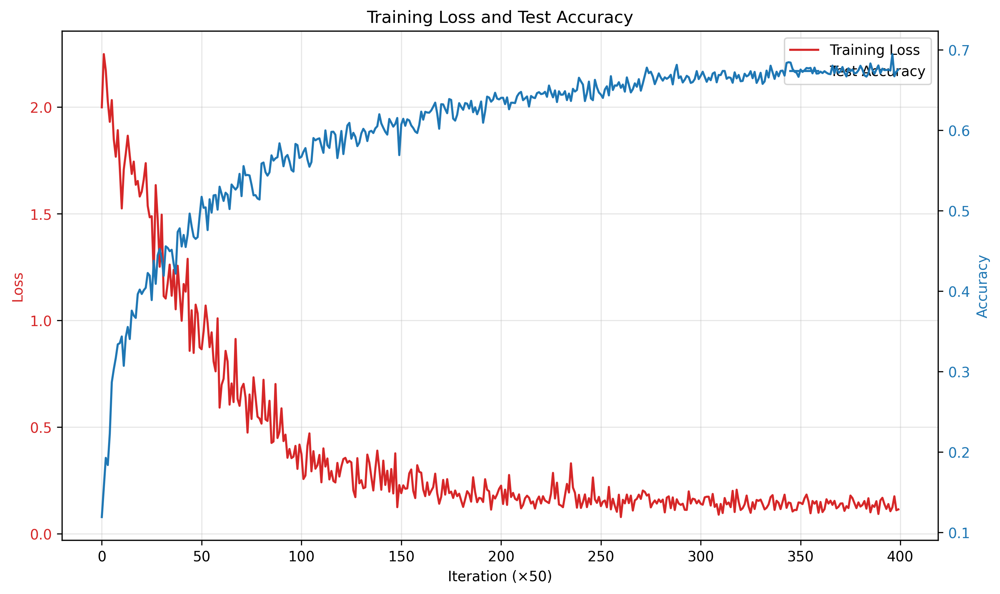
</div>
<div style="text-align: center;">
  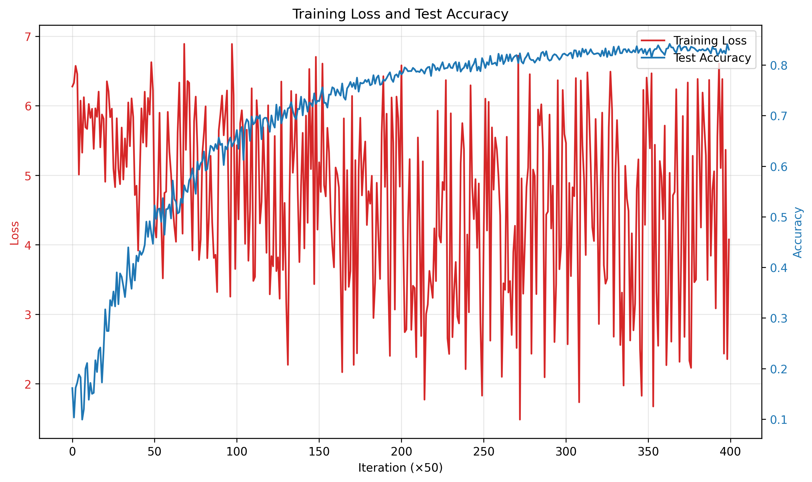
  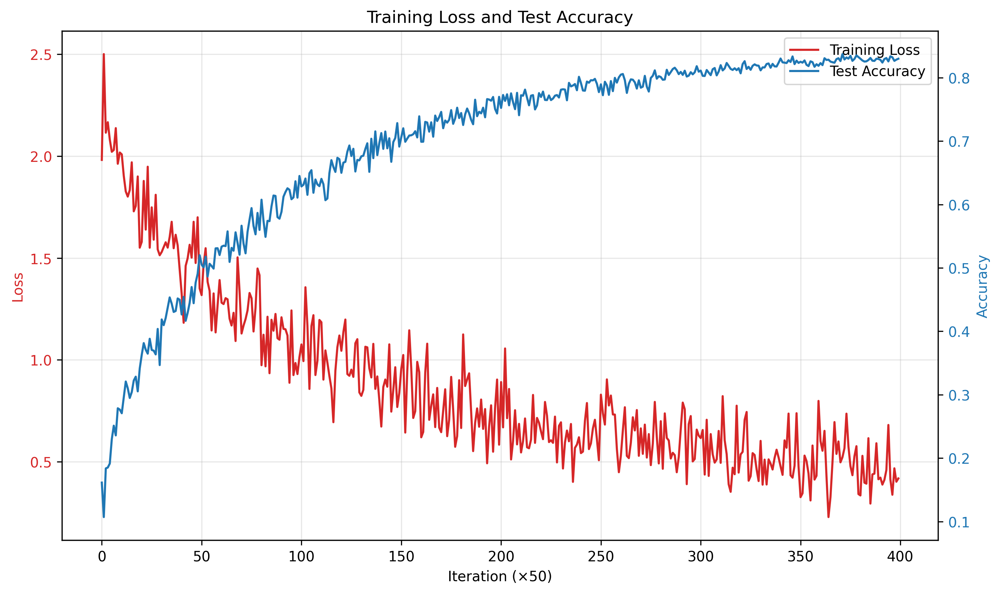
</div>
可以看出如下一些特点：

- 在每一类只选 40 个有标签数据的情况下，MixMatch 训练效果非常差，很早就出现了过拟合情况
- 在每一类选 250 个有标签数据的情况下，MixMatch 和 FixMatch 训练 20000 个 iteration 所能收敛到的测试准确率相差不大，均能达到 70% 左右
- 在每一类选 4000 个有标签数据的情况下，MixMatch 和 FixMatch 训练 20000 个 iteration 所能收敛到的测试准确率相差不大，均能达到 80% 左右
- MixMatch 训练过程的损失值摆动范围更大，相比之下 FixMatch 则非常小，这也与 FixMatch 只选用置信区间之内的数据有关，符合理论

### TorchSSL

以下是我的 MixMatch(左列) 和 FixMatch(右列) 用每类 40(第一行)、250(第二行)、4000(第三行) 训练过程的损失和测试准确率变化情况图：

<div style="text-align: center;">
  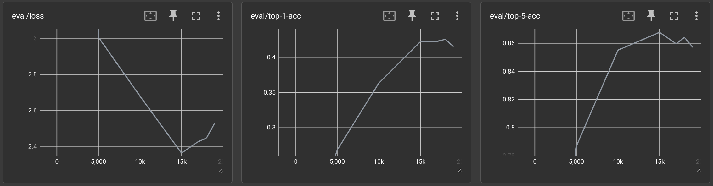
  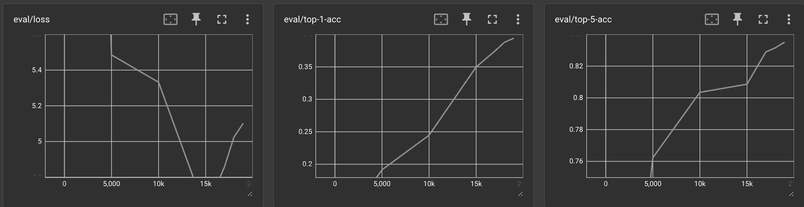
</div>
<div style="text-align: center;">
  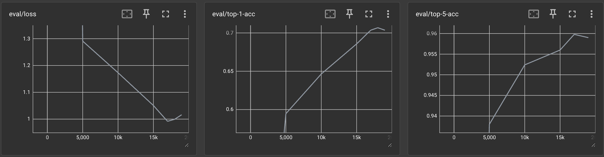
  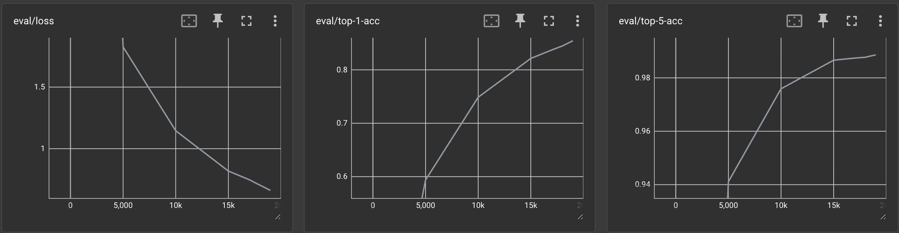
</div>
<div style="text-align: center;">
  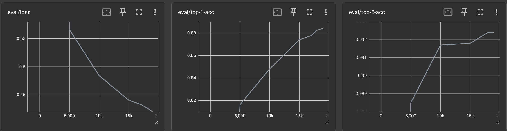
  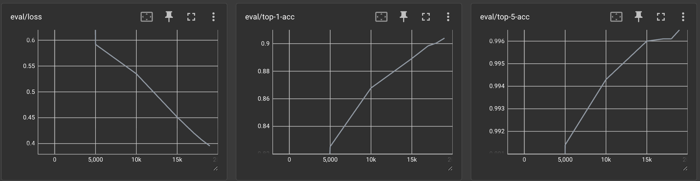
</div>

注意到 TorchSSL 使用 Tensorboard 收集了 Top-1 和 Top-5 ACC 两种准确率评估，这里我只看 Top-1 ACC，因为我的代码实现只收集了这一种。可以看到：

- 对于每类 40 个有标签数据，我们的实现训练都只能达到 40% 左右，但是 TorchSSL 的实现相比之下没有那么早过拟合
- 对于每类 250 个有标签数据，我的实现训练都只能达到 70% 左右，但是 TorchSSL 的 FixMatch 能够到达 85%
- 对于每类 4000 个有标签数据，我的实现训练都只能达到 80% 左右，但是 TorchSSL 能够到达 99%

TorchSSL 的代码实现更加复杂，相比之下比我的代码训练效果要更好。

另外，比较我的代码和 TorchSSL 的代码的训练时间，在相同算法和 iteration 条件下，训练时间基本没有差别。同时显存占用也基本没有差别，因为使用的 batch_size 都相同。

## 算法比较

### 相同点

1. 都利用一致性正则化思想，通过对无标签数据的不同增强实现
2. 都结合了有监督和无监督损失
   - 有标签数据使用交叉熵计算损失
   - 无标签数据使用 MSE 计算损失
3. 都使用 WideResNet-28-2 作为骨干网络
4. 都使用 SGD 优化器

### 不同点

| 特性        | MixMatch                          | FixMatch                          |
|-------------|-----------------------------------|-----------------------------------|
| 核心思想    | 熵最小化+一致性正则化+MixUp       | 伪标签+一致性正则化               |
| 无标签利用  | K次增强平均+锐化                  | 弱增强生成伪标签+强增强监督       |
| 数据增强    | 标准增强+无标签数据K次增强         | 弱增强+强增强                     |
| 伪标签      | 锐化后的平均预测                  | 阈值过滤的高置信度预测            |
| 损失函数    | 对mixup后的数据MSE或交叉熵         | 交叉熵损失                        |
| 超参数      | λu=75, T=0.5, K=2, α=0.75        | λu=1, 阈值=0.95                   |
| 代码实现    ｜ 更复杂                           | 更简单                            |
| 训练显存要求 | 较小                             | 较大，是相同 batch_size 下 MixMatch 的 6～7 倍 |
| 训练时间    ｜ 较短，训练较快                    | 较长，是相同 batch_size 下 MixMatch 的 4～6 倍 |

这里训练显存要求和训练时间的比较来自我的代码实现和 TorchSSL 的代码实现进行测试的观察结果。