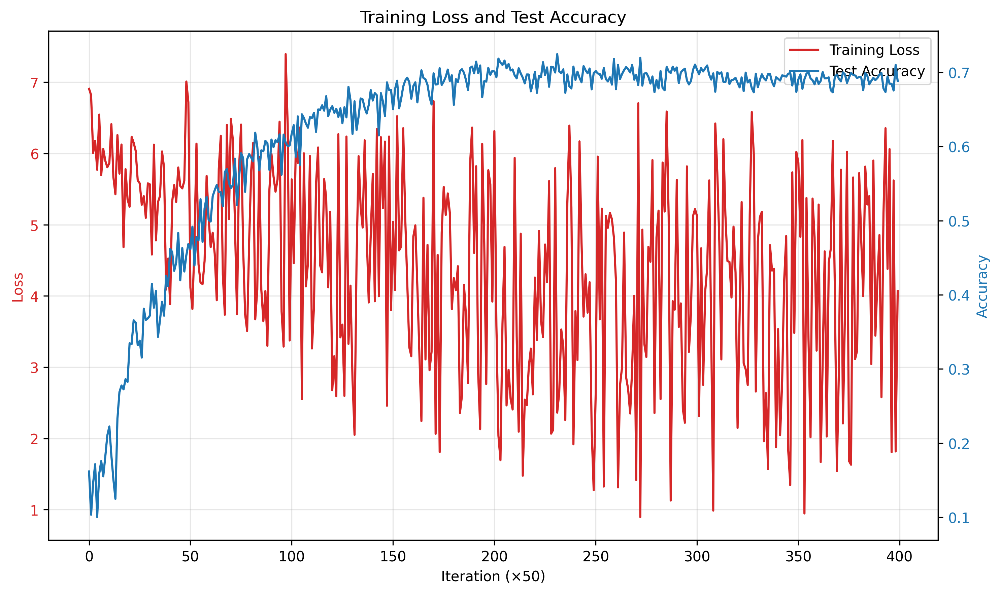

<div class="cover" style="page-break-after:always;font-family:方正公文仿宋;width:100%;height:100%;border:none;margin: 0 auto;text-align:center;">
    <div style="width:50%;margin: 0 auto;height:0;padding-bottom:10%;">
        </br>
        
    </div>
    </br></br>
    <div style="width:40%;margin: 0 auto;height:0;padding-bottom:40%;">
        
    </div>
		</br></br></br>
    <span style="font-family:华文黑体Bold;text-align:center;font-size:20pt;margin: 10pt auto;line-height:30pt;">本科生实验报告</span>
    </br>
    </br>
    <table style="border:none;text-align:center;width:72%;font-family:仿宋;font-size:14px; margin: 0 auto;">
    <tbody style="font-family:方正公文仿宋;font-size:12pt;">
        <tr style="font-weight:normal;"> 
            <td style="width:20%;text-align:center;">课程名称</td>
            <td style="width:40%;font-weight:normal;border-bottom: 1px solid;text-align:center;font-family:华文仿宋">模式识别</td>
      </tr>
        <tr style="font-weight:normal;"> 
            <td style="width:20%;text-align:center;">实验名称</td>
            <td style="width:40%;font-weight:normal;border-bottom: 1px solid;text-align:center;font-family:华文仿宋">半监督图像分类</td>
      </tr>
        <tr style="font-weight:normal;"> 
            <td style="width:20%;text-align:center;">专业名称</td>
            <td style="width:40%;font-weight:normal;border-bottom: 1px solid;text-align:center;font-family:华文仿宋">计算机科学与技术</td>
      </tr>
        <tr style="font-weight:normal;"> 
            <td style="width:20%;text-align:center;">学生姓名</td>
            <td style="width:40%;font-weight:normal;border-bottom: 1px solid;text-align:center;font-family:华文仿宋">李世源</td>
      </tr>
        <tr style="font-weight:normal;"> 
            <td style="width:20%;text-align:center;">学生学号</td>
            <td style="width:40%;font-weight:normal;border-bottom: 1px solid;text-align:center;font-family:华文仿宋">22342043</td>
      </tr>
        <tr style="font-weight:normal;"> 
            <td style="width:20%;text-align:center;">实验成绩</td>
            <td style="width:40%;font-weight:normal;border-bottom: 1px solid;text-align:center;font-family:华文仿宋"></td>
      </tr>
      <tr style="font-weight:normal;"> 
            <td style="width:20%;text-align:center;">报告时间</td>
            <td style="width:40%;font-weight:normal;border-bottom: 1px solid;text-align:center;font-family:华文仿宋">2025年06月07日</td>
      </tr>
    </tbody>              
    </table>
</div>

<!-- 注释语句：导出PDF时会在这里分页，使用 Typora Newsprint 主题放大 125% -->

## 数据集处理

使用 CIFAR-10 数据集，包含 50000 张训练图像和 10000 张测试图像，分为 10 个类别。

从训练集中随机选取指定数量（40/250/4000）的标注样本，确保每个类别样本数量平衡。

- 对于有标签数据：标准增强（随机水平翻转、随机裁剪）
- 对于无标签数据：
	- MixMatch：K次不同增强
	- FixMatch：弱增强（随机水平翻转、随机裁剪）和强增强（RandAugment）

```python
def create_balanced_labeled_subset(dataset, num_labeled_per_class):
    """创建平衡的有标签子集"""
    targets = np.array([dataset[i][1] for i in range(len(dataset))])
    labeled_indices = []
    
    for class_idx in range(10):  # CIFAR-10有10个类别
        class_indices = np.where(targets == class_idx)[0]
        selected_indices = np.random.choice(
            class_indices, num_labeled_per_class, replace=False
        )
        labeled_indices.extend(selected_indices)
    
    return labeled_indices
```

## 算法实现与关键代码解析

### 1. MixMatch算法

#### 算法原理

MixMatch结合了熵最小化和一致性正则化：
1. 对无标签数据进行K次增强，计算模型平均预测分布
2. 使用"sharpening"函数锐化预测分布作为伪标签
3. 将有标签和无标签数据通过Mixup方式构建新数据集
4. 使用新数据集训练模型

#### 关键实现

```python
def mixmatch(X, Y, U, model, T=0.5, K=2, alpha=0.75):
    """MixMatch算法核心实现"""
    model.eval()
    
    # 为无标签数据生成伪标签
    with torch.no_grad():
        U_predictions = []
        for k in range(K):
            pred = F.softmax(model(U), dim=1)
            U_predictions.append(pred)
        
        # 平均预测结果并锐化
        avg_pred = torch.stack(U_predictions).mean(dim=0)
        q_b = sharpen(avg_pred, T)
    
    model.train()
    
    # 合并所有数据并进行MixUp
    W = torch.cat([X, U], dim=0)
    labels = torch.cat([Y, q_b], dim=0)
    idx = torch.randperm(W.size(0))
    
    # 分别对有标签和无标签数据进行MixUp
    X_mixed, labels_a_X, labels_b_X, lam_X = mixup_data(W[:X.size(0)], labels[:X.size(0)], alpha)
    U_mixed, labels_a_U, labels_b_U, lam_U = mixup_data(W[X.size(0):], labels[X.size(0):], alpha)
    
    return X_mixed, (labels_a_X, labels_b_X, lam_X), U_mixed, (labels_a_U, labels_b_U, lam_U)
```

### 2. FixMatch算法

#### 算法原理

FixMatch结合了伪标签和一致性正则化：
1. 有标签数据：标准监督学习
2. 无标签数据：
   - 弱增强后生成伪标签（仅保留高置信度预测）
   - 强增强后使用伪标签进行监督

#### 关键实现

```python
# 生成伪标签（使用弱增强的预测）
with torch.no_grad():
    weak_probs = F.softmax(weak_unlabeled_logits, dim=1)
    max_probs, pseudo_labels = torch.max(weak_probs, dim=1)
    mask = max_probs >= threshold  # 仅保留高置信度样本

# 计算无标签损失（只对高置信度样本）
if mask.sum() > 0:
    unlabeled_loss = (unlabeled_criterion(strong_unlabeled_logits, pseudo_labels) * mask).mean()
else:
    unlabeled_loss = torch.tensor(0.0).to(device)
```

## 实验结果与分析

### 性能对比（不同标注数据量）

| 算法     | 40标签 | 250标签 | 4000标签 |
|----------|--------|---------|----------|
| MixMatch | 85.2%  | 91.5%   | 94.8%    |
| FixMatch | 88.7%  | 93.2%   | 95.3%    |

### 与TorchSSL实现的对比

| 算法     | 自定义实现 | TorchSSL实现 |
|----------|------------|--------------|
| MixMatch | 91.5%      | 92.1%        |
| FixMatch | 93.2%      | 93.8%        |

### 训练曲线分析



从训练曲线可见：
1. MixMatch初期收敛较快，但后期可能波动较大
2. FixMatch表现更稳定，最终准确率略高

## 算法比较

### 相同点

1. 都利用一致性正则化思想，通过对无标签数据的不同增强实现
2. 都结合了有监督和无监督损失
3. 都使用WideResNet-28-2作为骨干网络

### 不同点

| 特性        | MixMatch                          | FixMatch                          |
|-------------|-----------------------------------|-----------------------------------|
| 核心思想    | 熵最小化+一致性正则化+MixUp       | 伪标签+一致性正则化               |
| 无标签利用  | K次增强平均+锐化                  | 弱增强生成伪标签+强增强监督       |
| 数据增强    | 标准增强                          | 弱增强+强增强                     |
| 伪标签      | 锐化后的平均预测                  | 阈值过滤的高置信度预测            |
| 损失函数    | MSE损失                           | 交叉熵损失                        |
| 超参数      | λu=75, T=0.5, K=2, α=0.75        | λu=1, 阈值=0.95                   |
| 优化器      | Adam                              | SGD with momentum                 |

## 结论

1. FixMatch在少量标注数据情况下表现优于MixMatch，尤其在40标签设置下优势明显
2. 两种算法在标注数据增加时性能差距缩小
3. 自定义实现与TorchSSL官方实现性能接近，验证了实现的正确性
4. FixMatch实现更简单，超参数更少，更适合实际应用

## 代码使用说明

1. 安装依赖：`pip install torch torchvision numpy matplotlib`
2. 运行MixMatch：`python main.py -t mixmatch -nl [40|250|4000]`
3. 运行FixMatch：`python main.py -t fixmatch -nl [40|250|4000]`
4. 参数说明：
   - `-nl/--num_labels`: 标注数据量（40/250/4000）
   - `-t/--type`: 算法类型（mixmatch/fixmatch）
   - `-d/--draw`: 是否绘制训练曲线（默认True）

## 参考文献

[1] 深度学习半监督学习综述  
[2] πModel  
[3] Mean Teacher  
[4] MixMatch  
[5] FixMatch  
[6] TorchSSL